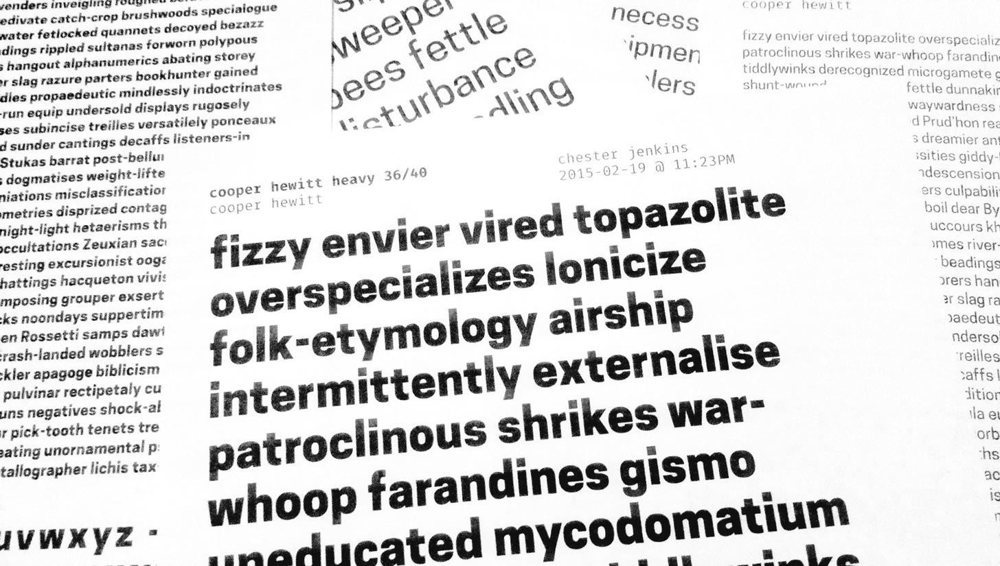

***

# Proof

A very basic template for proofing type with InDesign. Intended for use with generated sample text from [Word-O-Mat](https://github.com/ninastoessinger/word-o-mat).

__[Download](https://github.com/kennethormandy/proof/archive/master.zip)__

## Considerations

- __Includes space for basic information__ so your instructors and mentors know what they are looking at
- __Automatically updates the date and time__ on print or export so you don’t get confused about what proof you’re reviewing
- __Includes reference glyph section__ so you can mark all corrections in one place

## Contributing

Comments or suggestions for future versions? Made your own version of the template? [Open an issue on GitHub](https://github.com/kennethormandy/proof/issues/) and let me know, or [reply to me on Twitter](http://twitter.com/kennethormandy). Thanks!

## License

[The MIT License (MIT)](LICENSE.md)

Copyright © 2014–2015 [Kenneth Ormandy](http://kennethormandy.com)

[Mozilla’s Fira](https://github.com/mozilla/Fira) is included in this project [under the terms of its license](https://github.com/mozilla/Fira/blob/master/LICENSE). Examples use the [Cooper Hewitt typeface](https://github.com/cooperhewitt/cooperhewitt-typeface).
